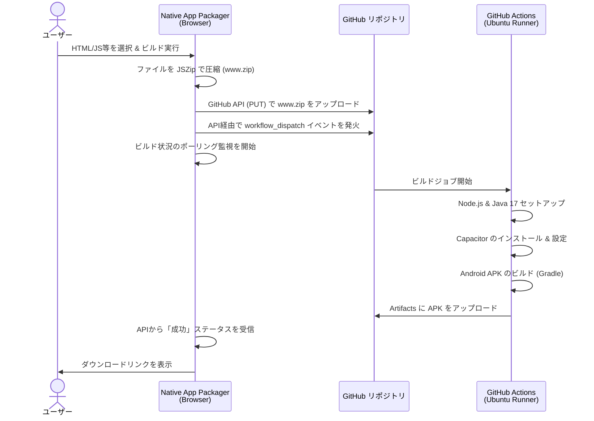

提供されたHTMLコードを分析し、プロジェクトの魅力を最大限に伝える高品質な `README.md` を作成しました。

機能の概要から使い方、内部のアーキテクチャまで網羅しており、GitHubなどのリポジトリにそのまま配置して使用できる構成になっています。

---

# ⚡ Native App Packager

**Webアセット（HTML/CSS/JS）をブラウザから直接Androidアプリ（APK）にビルド・パッケージングする完全サーバーレスなWebアプリケーション。**

お手持ちのWebアプリケーションのファイルをドラッグ＆ドロップするだけで、GitHub API と GitHub Actions を活用してクラウド上でネイティブアプリ（Capacitorベース）を自動生成します。

## ✨ 主な機能 (Features)

*   **📦 ドラッグ＆ドロップで簡単アップロード**
    *   HTML, CSS, JS, 画像などのWebアセットをブラウザ上で直接ZIP化（`JSZip`使用）。
*   **☁️ クラウドネイティブビルド**
    *   バックエンドサーバーは不要。GitHub API経由で直接リポジトリと通信し、GitHub ActionsをトリガーしてAndroid APKをビルドします。
*   **🤖 ワークフローの自動生成**
    *   対象リポジトリにビルド用のActionsワークフロー (`build-apk.yml`) がない場合、自動的に生成してコミットします。
*   **👀 リアルタイム・ビルド監視**
    *   コンソール風のUIでデプロイ状況をリアルタイムに表示。Actionsのステータスをポーリングし、完了と同時にダウンロードリンクを提供します。
*   **📱 PWA対応 & Wake Lock**
    *   スマートフォンやタブレットからでもPWAとしてインストール可能。ビルド監視中の画面スリープを防止するWake Lock APIも搭載しています。
*   **🔒 セキュアな設定管理**
    *   GitHub Personal Access Token (PAT) などの設定はブラウザの `IndexedDB` に安全に保存され、外部サーバーには一切送信されません。

## 🏗️ アーキテクチャと処理フロー

本アプリは、ブラウザ（フロントエンド）とGitHubエコシステムのみで完結するモダンな構成になっています。アプリのコア技術として **Capacitor** を利用し、Webビューをラップしたネイティブアプリを生成します。

## 🚀 前提条件 (Prerequisites)

本ツールを使用するには、以下のGitHub環境が必要です。

1.  **GitHub アカウント**
2.  **空のGitHubリポジトリ**（ビルド処理を行うための作業場）
3.  **GitHub Personal Access Token (PAT)**
    *   Classic Token の場合は `repo` と `workflow` スコープが必要です。
    *   Fine-grained Token の場合は、対象リポジトリに対する `Contents` および `Actions` のRead/Write権限が必要です。

## 📖 使い方 (Usage)

### 1. 初期設定 (GitHub連携)
1. 画面右上の **「⚙️ 設定アイコン」** をクリックします。
2. 取得した **GitHub PAT** を入力し、「💾 トークンを保存して接続」をクリックします（ユーザー名が自動取得されます）。
3. 「デプロイ先リポジトリ」のドロップダウンから、ビルド作業用に使用するリポジトリを選択します。
4. 設定パネルを閉じます。

### 2. アプリ設定
*   **アプリの表示名**: スマートフォンにインストールされた際に表示されるアプリ名（例: `My Cool App`）。
*   **パッケージID**: アプリの一意の識別子（例: `com.yourname.app`）。

### 3. Webアセットの準備とデプロイ
1. `index.html` を頂点とするWebアプリの構成ファイル一式を選択、または点線エリアにドラッグ＆ドロップします。
2. **「🚀 パッケージ & デプロイ」** ボタンをクリックします。
3. 自動的にファイルのアップロード、ワークフローの生成、GitHub Actionsのトリガーが行われます。

### 4. ダウンロード
*   コンソール画面で「Building...」の進行状況を確認します。
*   ビルドが成功すると、**「📥 APKをダウンロード」** のリンクが表示されます。リンク先のGitHub ArtifactsページからZIPファイルをダウンロードし、解凍してAPKファイルを取得してください。

## 🛠️ 技術スタック

*   **UI / Design**: HTML5, CSS3 (CSS Variables, Flexbox, Animations)
*   **Logic**: Vanilla JavaScript (ES6+)
*   **Storage**: IndexedDB API
*   **Archiving**: [JSZip](https://stuk.github.io/jszip/) (CDN経由で読み込み)
*   **Integration**: GitHub REST API, GitHub Actions
*   **Native Wrapper Engine**: [Ionic Capacitor](https://capacitorjs.com/) (Actions内で実行)

## 🛡️ セキュリティとプライバシー

本ツールは完全にクライアントサイド（Webブラウザ内）で動作します。
入力されたGitHubトークンや、アップロードされたソースコードは、**指定したGitHubリポジトリ以外の第三者のサーバーに送信されることは一切ありません。**
トークン情報はブラウザのローカルデータベース（IndexedDB）にのみ保存されます。不要になった場合は設定画面から「🗑️ 設定を初期化」を実行してください。

## ⚠️ 注意事項

*   GitHub Actionsの無料枠（パブリックリポジトリは無料、プライベートリポジトリは月間無料枠あり）を消費します。
*   アップロードするファイル群には、必ずエントリーポイントとなる `index.html` がルート階層に含まれている必要があります。
*   ネットワーク環境やGitHub Actionsの混雑状況により、ビルドに数分（通常2〜5分）かかる場合があります。

## 📄 ライセンス

This project is licensed under the MIT License - see the [LICENSE](LICENSE) file for details.